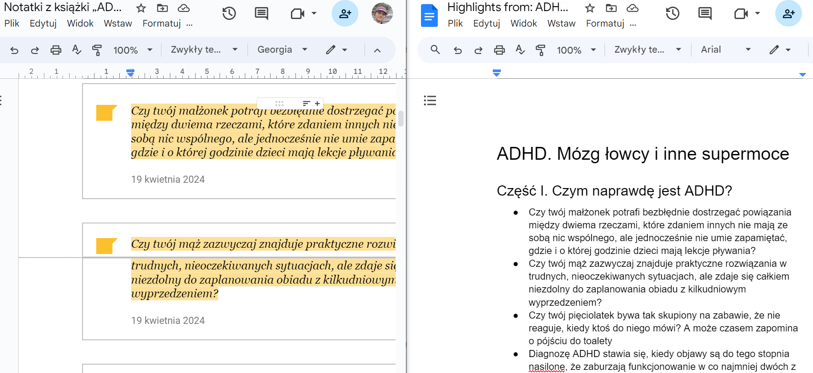

<!--Category:GAS--> 
 

    <a href="http://productivitytools.top/gmail-rules/"><a> 
    

    

# Google notes to highlights

It converts Google notes from Google Playbooks to document in different format.
 <!--more-->

## How it is working
- For each Google Book notes it checks if it has already the highlights. If yes it skips all next steps. The idea is that after generation highlights we need to change it a little bit. For example remove words that were marked but are not needed.
- For each Google Book notes creates the highlights file. It changes the format from the table to bulletpoint list

